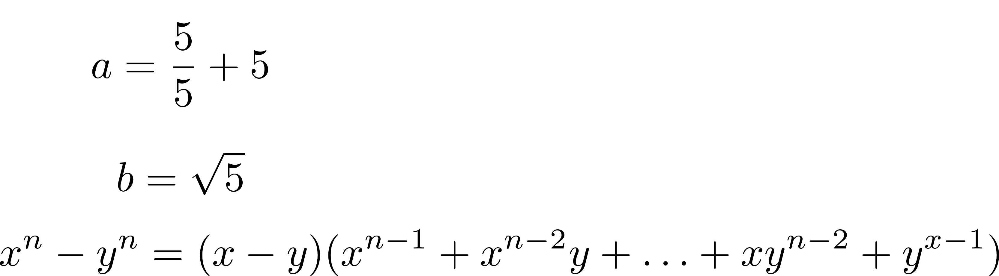

# Mathovi

Mathovi is a simple project inteded to make generating math equations easier.

It works by taking in a series of semicolon seperated math equations and producing a png of these mathematical equations using LaTeX.

Currently there is only support for simple algebra and simple trigonometric functions such as sin and cos, however I plan on adding more complicatied notation such as derivatives and integrals

## Dependencies

You will need LaTeX installed on your machine.

## Quick Start

```console
cargo build --release
mathovi --input <input_file> --output <output_file>
```

## Example

```
a = 5 / 5 + 5;

b = sqrt(5);

(x^n - y^n) = (x-y) * (x^(n-1) + x^(n-2)*y + ... + x*y^(n-2) + y^(x-1));
```



## Plans

- Support For Simple Calculus Expressions, derivatives / integrals
- Support For Linear Algebra Expressions, Vectors / Matrices
